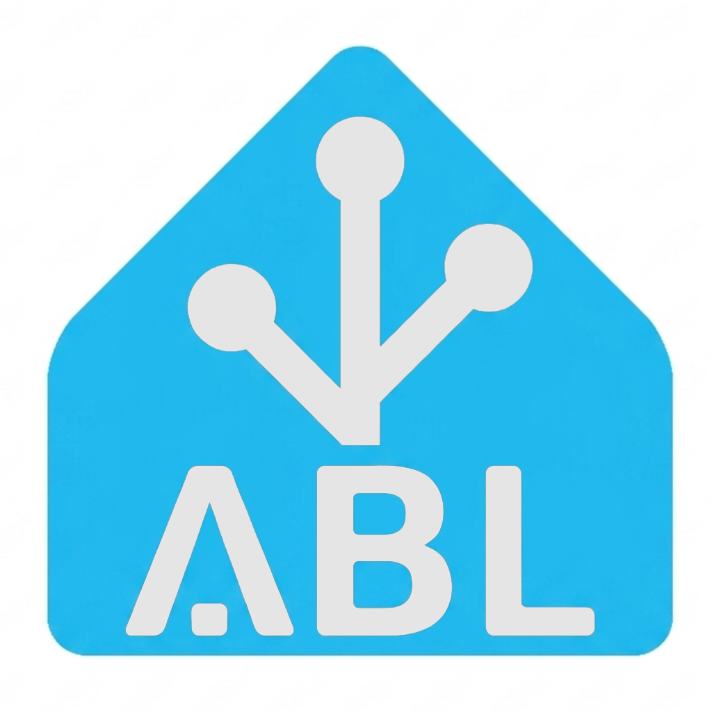
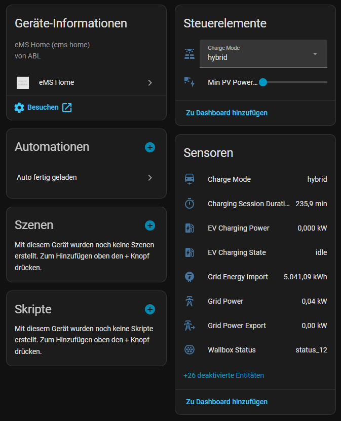

# ABL eMS Home for Home Assistant

[![Add Integration][add-integration-badge]][add-integration]

Custom Home Assistant integration for the **ABL eMS Home** energy management system. Provides real-time smart meter data via WebSocket, EV charging monitoring, and charge mode control for ABL eMH1 wallboxes.

## Screenshots

### Integration in Home Assistant

## Features

- 🔌 **EV Charging Power** – Total and per-phase (L1/L2/L3)
- ⚡ **Smart Meter Data** – Grid power, voltage, current, frequency, energy import (real-time via WebSocket)
- 🚗 **Charge Mode Control** – Switch between Grid, PV, Hybrid, and Lock via dropdown
- ☀️ **PV Quota Slider** – Adjust minimum PV surplus percentage
- 🖥️ **Device Health** – CPU load/temp, RAM and flash usage
- 🔄 **Auto-reconnect** – WebSocket reconnects automatically with exponential backoff
- 🔐 **OAuth2 Authentication** – Automatic token management and renewal

## Installation via HACS (Custom Repository)

1. Open Home Assistant → **HACS** → **Integrations** → **⋮ (Menu)** → **Custom repositories**
2. Enter: `https://github.com/TorbenStriegel/eMS-Home-HomeAssistant`
3. Category: **Integration** → Click **Add**
4. Search for **ABL eMS Home** and install
5. **Restart Home Assistant**

## Manual Installation

1. Download or clone this repository
2. Copy the `custom_components/ems_home` folder into your Home Assistant `config/custom_components/` directory
3. Restart Home Assistant

## Configuration

1. Add the integration:  or go to **Settings** → **Devices & Services** → **Add Integration** and search for **eMS Home**
2. Enter your connection details:

| Option | Description | Default |
|---|---|---|
| **Host** | IP address or hostname (e.g. `ems-home-12345678`) | – |
| **Password** | Password from the rating plate on the device | – |
| **Port** | HTTP port | `80` |
| **Poll interval** | Seconds between HTTP data updates | `5` |

The poll interval can be changed later under **Options** without reconfiguring.

## Sensors

### EV Charging
| Sensor | Unit | Description |
|---|---|---|
| EV Charging Power | kW | Total charging power |
| EV Charging Power L1/L2/L3 | kW | Per-phase charging power |
| EV Charging State | – | `idle`, `charging`, or `locked` |
| Curtailment Setpoint | kW | Load management curtailment |

### Smart Meter (Real-Time via WebSocket)
| Sensor | Unit | Description |
|---|---|---|
| Grid Power | kW | Total grid active power |
| Grid Power L1/L2/L3 | kW | Per-phase grid power |
| Grid Apparent Power | kVA | Total apparent power |
| Grid Voltage L1/L2/L3 | V | Per-phase voltage |
| Grid Current L1/L2/L3 | A | Per-phase current |
| Grid Frequency | Hz | Grid frequency |
| Grid Energy Import | kWh | Total energy imported |
| Grid Energy Export | kWh | Total energy exported |
| Grid Power Export | kW | Active power export |
| Grid Reactive Power | var | Reactive power total |
| Grid Power Factor | – | Power factor (cos φ) |

### Charge Mode Control
| Entity | Type | Description |
|---|---|---|
| Charge Mode | Select | Switch between `grid`, `pv`, `hybrid`, `lock` |
| Min PV Power Quota | Number (Slider) | PV surplus % (0–100) |

### Device Health
| Sensor | Unit | Description |
|---|---|---|
| Device Status | – | Device state (e.g. `idle`) |
| CPU Load | % | CPU utilization |
| CPU Temperature | °C | CPU temperature |
| RAM Usage | % | RAM utilization |
| Flash Data Usage | % | Flash storage utilization |

### Wallbox / EVSE (Real-Time via WebSocket)
| Sensor | Unit | Description |
|---|---|---|
| Wallbox Status | – | EVSE state (e.g. `charging`, `available`, `suspended_evse`) |
| Charging Session Duration | min | Duration of the current/last charging session |
| Wallbox Serial | – | Serial number of the connected wallbox |
| Wallbox Max Current | A | Hardware maximum current rating |
| Wallbox Error Code | – | Current error code (or `none`) |

> 💡 Some sensors are disabled by default (e.g. per-phase values, device health). Enable them in the entity settings.

## Supported Hardware

- **ABL eMS Home** energy management system
- **ABL eMH1** wallboxes (connected via RS485)
- Smart meters connected to the eMS Home

## Requirements

- ABL eMS Home device on your local network
- Home Assistant 2024.1 or newer
- The device password (printed on the rating plate)

## Troubleshooting

| Problem | Solution |
|---|---|
| **Cannot connect** | Ensure the eMS Home is reachable from HA's network. Check host/IP and port. |
| **Invalid auth** | Verify the password matches the one on the rating plate. Username is always `admin`. |
| **Sensors unavailable** | Check HA logs (`Logger: custom_components.ems_home`). The WebSocket auto-reconnects after connection loss. |
| **Smart meter sensors empty** | Data may take a few seconds after startup. If they remain empty, verify a smart meter is connected to the eMS Home. |

## License

This project is licensed under the [MIT License](LICENSE).

## Credits

Based on reverse-engineering of the ABL eMS Home local API. This project is not affiliated with or endorsed by ABL.

[add-integration]: https://my.home-assistant.io/redirect/config_flow_start?domain=ems_home
[add-integration-badge]: https://my.home-assistant.io/badges/config_flow_start.svg

